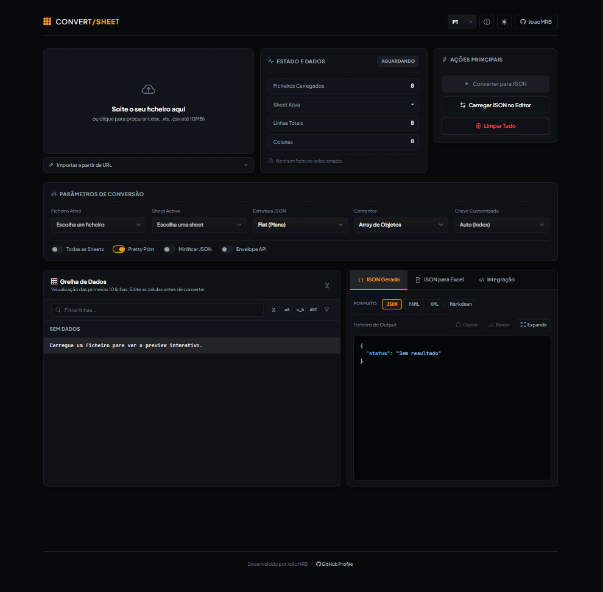

# Convert/Sheet

[English](./README.md) | [Português](./README.pt-PT.md)

Convert/Sheet is a small browser tool for converting Excel and CSV files into JSON, YAML, XML or Markdown. It also lets you edit the imported data before exporting it, and can turn JSON back into an `.xlsx` file.

Everything runs in the browser. No backend, no account, no file uploads.

Created by [JoãoMRB](https://github.com/JoaoMRB).

## Demo

Live version:

[https://joaomrb.github.io/ConverterJson/](https://joaomrb.github.io/ConverterJson/)



## What It Does

- Converts `.xlsx`, `.xls` and `.csv` files.
- Exports to JSON, YAML, XML and Markdown.
- Converts valid JSON back to Excel.
- Lets you preview and edit the imported rows before exporting.
- Supports multiple sheets.
- Supports flat JSON and nested JSON using dot notation.
- Exports as an array of objects or as an indexed object.
- Lets you choose a custom key field for indexed output.
- Validates column types: text, number, boolean and date.
- Includes simple cleanup tools for whitespace, empty rows and column names.
- Filters rows in the preview table.
- Generates integration snippets for Fetch, Axios, Python and cURL.
- Includes dark and light themes.

## Privacy

Files are processed locally in your browser. Convert/Sheet does not upload your spreadsheets or JSON data to an application server.

The URL import option depends on the external server allowing browser access through CORS.

## How to Use

1. Open the app in your browser.
2. Drop an `.xlsx`, `.xls` or `.csv` file into the upload area.
3. Choose the sheet and output options.
4. Edit or clean the preview data if needed.
5. Click **Convert to JSON**.
6. Copy or download the result.

## GitHub Pages

The GitHub Pages URL is:

```text
https://joaomrb.github.io/ConverterJson/
```

To publish it yourself:

1. Open the repository on GitHub.
2. Go to **Settings** -> **Pages**.
3. Choose **Deploy from a branch**.
4. Select the main branch and the `/root` folder.
5. Save the changes.

## Tech Stack

- HTML5
- CSS3
- JavaScript
- Bootstrap 5
- Bootstrap Icons
- SheetJS / XLSX
- Highlight.js

## Project Structure

```text
ConverterJson/
|-- docs/
|   `-- preview.png
|-- Index.html
|-- app.js
|-- styles.css
|-- favicon.svg
|-- README.md
`-- README.pt-PT.md
```

## Notes

- The recommended file limit is 10 MB.
- URL imports can fail when the source server blocks CORS.
- Very large files depend on the browser's available memory.
- Some libraries are loaded from CDNs, so the app needs internet access.

## Possible Improvements

- Add sample input and output files.
- Add a short GIF showing the main workflow.
- Improve keyboard navigation and accessibility details.
- Add automated tests for conversion helpers.
- Provide a fully offline version with local dependencies.

## Author

Created by [JoãoMRB](https://github.com/JoaoMRB).
